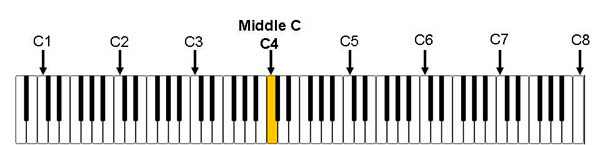

# Music Stuff
## Table of Contents
* [Pitches](#pitches)
* [Intervals](#intervals)
* [Scales](#scales)
* [Rhythm](#rhythm)
* [Chords](#chords)
* [Functional Harmony](#functional)
* [Improvising](#improvising)
* [Ear Training](#ear-training)
* [Learning Songs by Ear](#learning-by-ear)
* [Learning Jazz Standards](#jazz-standards)

## Pitches
In Western music, there are twelve pitches. The easiest way to visualize this is by looking at a keyboard. On a keyboard, moving to the right results in higher pitches and moving to the left results in lower pitches.

The first pitch you should learn to identify is "C". On a keyboard, there are white notes and black notes. The black notes alternate between sets of two and three. The white key immediately to the left of any set of two black keys is C.

Starting at C, the white notes in ascending order (moving to the right) are named C, D, E, F, G, A, and B. The black notes are named by their relationship to their adjacent white notes. For instance, the black note immediately to the right of C can be called C# (C sharp). Alternatively, the same pitch can be called Db (D flat) because it is immediately to the left of D.

White notes can also be named in terms of sharps or flats. For instance, in some circumstances, you might call E "Fb", or you might call F "E#". Whether a particular note is "sharp", "flat", or "natural" depends on context, and can be useful when thinking about a particular [scale](#scales). However, you will get varying opinions on the importance of "correctly" naming notes. The important takeaway is that the same pitch can have multiple different names, and you should be able to find a note regardless of what it is called.

## Intervals
An interval is the distance between two pitches. Intervals, like pitches, can have multiple different names. The first interval to learn is a "half step", which is the smallest possible interval on a keyboard. From any note, the note a half step above it is the note immediately to the right. The note a half step below would be the note immediately to the left.

Example: C# is a half step above C. B is a half step below C. F#/Gb is a half step above F and a half step below G.

Here is a table of the names of all intervals based on the number of half steps between the notes. The last column is the note required to form that interval with C as the lowest note:

| # half steps | interval names | note above C |
|:---:|:---:|:---:|
| 0 | perfect unison | C |
| 1 | half step / minor second | C#/Db |
| 2 | whole step / major second | D |
| 3 | minor third | D#/Eb |
| 4 | major third | E |
| 5 | perfect fourth | F |
| 6 | tritone / augmented fourth / diminished fifth | F#/Gb |
| 7 | perfect fifth | G |
| 8 | minor sixth / augmented fifth | G#/Ab |
| 9 | major sixth | A |
| 10 | minor seventh / dominant seventh | A#/Bb |
| 11 | major seventh | B |
| 12 | perfect octave | C |

There are names for larger intervals, but we won't get into them here.

Each interval has a distinct sound. A major third will sound like a major third regardless of whether it is a C and an E or a G and a B. The pitches are different but the interval is the same. Check out the [ear training section](#ear-training) for information about how to learn how to identify intervals by ear.

A perfect octave is the distance between any pitch and the first instance of the same pitch up or down on the keyboard. On an 88 key piano, the lowest C is named C1, where 1 is the number of the octave. The octave number increases as you ascend the piano all the way to C8.

"Middle C" is an important reference point, and is defined by C4.

## Scales
A scale is a set of notes ordered by pitch. There are lots of different types of scales and we will only cover some of them here. Specific scales are denoted by their first pitch (e.g. C, G) and type (e.g. major, minor, blues). The first pitch is also known as the "tonic" or "first degree".

Types of scales are distinguished by the intervals between their notes starting at the tonic. In the table below, the intervals are defined for several types of scales. Starting with any note as the tonic, you can ascend the scale step by step using the intervals to play that scale.

"Degrees" are a useful way to define the notes of a scale as they are related to the tonic. The degrees of a major scale are 1, 2, 3, 4, 5, 6, and 7. Think of the major scale as the "default" scale.

Here's an example of how degrees can be useful: Let's say you know the C major scale. You know the C major scale consists of degrees 1, 2, 3, 4, 5, 6, and 7, or C, D, E, F, G, A, and B. You want to learn how to play C minor (natural), but don't know the intervals between the notes in a minor scale off the top of your head. What you do know, however, are the degrees of a natural minor scale: 1, 2, b3, 4, 5, b6, b7. This means you can take C major, flat the third, sixth, and seventh, and now you have C natural minor: C, D, Eb, F, G, Ab, Bb. The exact same process can be used to find the natural minor scale of any tonic, as long as you know the major scale in every key.

W denotes a whole step and H denotes a half step.

| type | intervals | degrees | with tonic C |
|:---:|:---:|:---:|:---:|
| major |	W, W, H, W, W, W, H | 1, 2, 3, 4, 5, 6, 7 | C, D, E, F, G, A, B |
| natural minor | W, H, W, W, H, W, W | 1, 2, b3, 4, 5, b6, b7 | C, D, Eb, F, G, Ab, Bb |
| harmonic minor | W, H, W, W, H, 3H, H | 1, 2, b3, 4, 5, b6, 7 | C, D, Eb, F, G, Ab, B |
| major pentatonic | W, W, 3H, W, 3H | 1, 2, 3, 5, 6 | C, D, E, G, A |
| minor pentatonic | 3H, W, W, 3H, W | 1, b3, 4, 5, b7 | C, Eb, F, G, Bb |
| blues | 3H, W, H, H, 3H, W | 1, b3, 4, b5, 5, b7 | C, Eb, F, Gb, G, Bb |

Notes about the table above:
* If you hear "minor scale" and "harmonic" or "melodic" is not specified, it's probably referring to the natural minor scale. But don't quote me on that; it's just my own personal experience and I'm mostly self taught.
* I omitted the melodic minor scale above because I don't feel like covering it. Fight me.
* The natural minor scale is the same pattern as the major scale shifted three half steps to the right. In other words, you can move three half steps (a minor third) down from the tonic in a major scale, play the same notes in the original major scale but starting at the new note, and you've played the natural minor scale. The minor scale that contains the same notes as a particular major scale is known as its "relative minor". For instance, playing all the white notes starting at C is the C major scale. A minor third down from C is A, so playing all the white notes starting at A is the A natural minor scale. The A minor scale is the relative minor of C major, and C major is the relative major of A minor.
* The same thing applies with the major and minor pentatonic scales, just with a different pattern.

One of the first exercises I would recommend is playing every major scale. Play C major up and down one octave. Then move up a half step and play C# major. Then D major, D# major, F major, etc...

## Rhythm

## Chords

## Functional Harmony

## Improvising

## Ear Training

## Learning Songs by Ear

## Learning Jazz Standards
