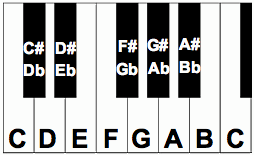

# Music Stuff
## Table of Contents
* [Notes](#notes)
* [Intervals](#intervals)
* [Scales](#scales)
* [Rhythm](#rhythm)
* [Chords](#chords)
* [Functional Harmony](#functional)
* [Improvising](#improvising)
* [Ear Training](#ear-training)
* [Learning Songs by Ear](#learning-by-ear)
* [Learning Jazz Standards](#jazz-standards)

## Notes
In Western music, there are twelve pitches. The easiest way to visualize this is by looking at a keyboard. On a keyboard, moving to the right results in higher pitches and moving to the left results in lower pitches.

The first pitch you should learn to identify is "C". On a keyboard, there are white notes and black notes. The black notes alternate between sets of two and three. The white key immediately to the left of any set of two black keys is C.

Starting at C, the white notes in ascending order (moving to the right) are named C, D, E, F, G, A, and B. The black notes are named by their relationship to their adjacent white notes. For instance, the black note immediately to the right of C can be called C# (C sharp). Alternatively, the same pitch can be called Db (D flat) because it is immediately to the right of D.

White notes can also be named in terms of sharps or flats. For instance, in some circumstances, you might call E "Fb", or you might call F "E#". Whether a particular note is "sharp", "flat", or "natural" depends on context, and can be useful when thinking about a particular [scale](#scales). However, you will get varying opinions on the importance of "correctly" naming notes. The important takeaway is that the same pitch can have multiple different names, and you should be able to find a note regardless of what it is called.

## Intervals
An interval is the distance between two pitches. Intervals, like pitches, can have multiple different names. The first interval to learn is a "half step", which is the smallest possible interval on a keyboard. From any note, the note a half step above it is the note immediately to the right. The note a half step below would be the note immediately to the left.

Example: C# is a half step above C. B is a half step below C. F#/Gb is a half step above F and a half step below G.

Here is a table of the names of all intervals based on the number of half steps between the notes. The last column is the note required to form that interval with C as the lowest note:

| # half steps | interval names | note above C |
|:---:|:---:|:---:|
| 0 | perfect unison | C |
| 1 | half step / minor second | C#/Db |
| 2 | whole step / major second | D |
| 3 | minor third | D#/Eb |
| 4 | major third | E |
| 5 | perfect fourth | F |
| 6 | tritone / augmented fourth / diminished fifth | F#/Gb |
| 7 | perfect fifth | G |
| 8 | minor sixth / augmented fifth | G#/Ab |
| 9 | major sixth | A |
| 10 | minor seventh / dominant seventh | A#/Bb |
| 11 | major seventh | B |
| 12 | perfect octave | C |

There are names for larger intervals, but we won't get into them here.

Each interval has a distinct sound. A major third will sound like a major third regardless of whether it is a C and an E or a G and a B. The pitches are different but the interval is the same. Check out the [ear training section](#ear-training) for information about how to learn how to identify intervals by ear.

## Scales

## Rhythm

## Chords

## Functional Harmony

## Improvising

## Ear Training

## Learning Songs by Ear

## Learning Jazz Standards
